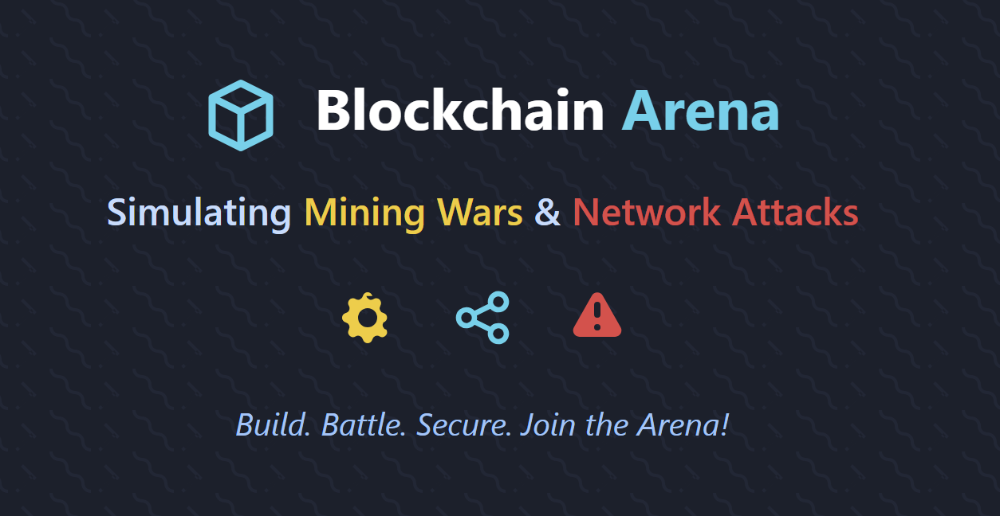

# Blockchain Arena: Simulating Mining Wars and Network Attacks 🚀

Welcome to the official repository for the Blockchain Arena project! This document serves as the central hub for our timeline, assignments, and resources.

## About The Project

Ready to jump into the Blockchain Arena? Ever wondered how Bitcoin really works and why people go crazy for crypto? Forget boring lectures – in this project, you'll build your own blockchain world from scratch!

We start with how to make a currency digital with no central authority, then dive straight into coding. Using your Python/C++ skills, you'll create a network of computers (nodes) that talk to each other, build digital blocks, chain them together, and watch a cryptocurrency network come to life.

## 🎯 Learning Objectives

By the end of this project, you will:
- Understand the foundational principles of blockchain technology and P2P networks.
- Implement a functional blockchain simulator with transactions and Proof-of-Work consensus.
- Gain hands-on experience with object-oriented programming, data structures, and discrete-event simulation.
- Build and deploy a basic decentralized application (DApp) on an Ethereum test network.

## 🛠️ Getting Started

### Prerequisites
* Good programming skills in Python or C++ (Comfortable with Object-Oriented Programming and basic Data Structures & Algorithms).
* No prior blockchain knowledge is required!
* Loads of curiosity and enthusiasm to dive deep into crypto tech!

### Essential Resources
This is a list of curated resources which will help you throughout the project.
* **Conceptual Foundations:**
    * **Video Resources:**
        * [The Hidden Secrets Of Money](https://youtube.com/playlist?list=PLE88E9ICdipidHkTehs1VbFzgwrq1jkUJ&si=s6Qgk_o59y2J1bG5) by Mike Maloney - Excellent for understanding the history and economics of money.
        * [But how does bitcoin actually work?](https://www.youtube.com/watch?v=bBC-nXj3Ng4) by 3Blue1Brown - A fantastic visual and mathematical explanation of blockchain.
        * [CS765: Introduction to Blockchain](https://youtube.com/playlist?list=PLfmqK5mMBWj9dEmo91RBJd3xHx4TQi8bA&si=sVTY00TIIJvl9EFT) by Prof. Vinay Ribeiro - University-level course material for in-depth concepts.
    * **Reading Material:**
        * [What Has Government Done to Our Money?](https://drive.google.com/file/d/15UQAAkn1evEfXEjxAHzkBGuXmJ6ONiQ1/view?usp=sharing) by Murray Rothbard – A classic introduction to the history and theory of money and government intervention.
        * [Bitcoin: A Peer-to-Peer Electronic Cash System](https://bitcoin.org/bitcoin.pdf) by Satoshi Nakamoto - The original whitepaper that started it all.
        * [Mastering Bitcoin](https://github.com/bitcoinbook/bitcoinbook) by Andreas M. Antonopoulos - A comprehensive guide to understanding Bitcoin.
* **Technical Support & Tools:**
    * [Git and GitHub Tutorial](https://youtu.be/tRZGeaHPoaw?si=9YvU-r4JeXSK76Sk) - Video tutorial for beginners.
    * [Learning C++](https://www.learncpp.com/) - A great resource for brushing up on C++.
    * [C++ Documentation](https://en.cppreference.com/w/) - Official C++ reference.
    * [Python 3 Documentation](https://docs.python.org/3/) - Official Python reference.
    * [Solidity Documentation](https://docs.soliditylang.org/) - Official Solidity reference.

---

## 🗓️ Project Timeline (8 Weeks)

### Weeks 1-2: Welcome to the Arena!
* **Learn:** Core blockchain concepts, what a P2P network is, and why decentralization matters. We'll set up our development environment using Git, Python/C++.
* **Assignment 1:** Build a basic P2P network structure where nodes can connect to each other.

### Weeks 3-4: Building the Chain
* **Learn:** Deep dive into the structure of blocks and transactions. We'll learn how information propagates through the network using a gossip protocol.
* **Assignment 2 (Part 1):** Simulate a P2P Cryptocurrency Network, allowing nodes to create and share blocks of transactions.

### Weeks 5-6: The Mining Race!
* **Learn:** The economics and mechanics of Proof-of-Work (PoW). We'll cover concepts like nonce, difficulty, and the *"longest chain wins"* rule for achieving consensus.
* **Assignment 2 (Part 2):** Simulate the PoW mining loop. Watch your nodes compete to solve cryptographic puzzles and add new blocks to the chain.

### Weeks 7-8: Create a Crypto Gem
* **Learn:** The basics of smart contracts using Solidity. We'll use the Remix IDE to build and deploy a simple DApp on an Ethereum test network (no real money needed!).
* **Assignment 4:** Create a simple mini-DApp (like an on-chain poll or voting system). You'll code a basic smart contract and connect it to a simple webpage.

---

## 🏆 Project Milestones

* **Checkpoint 1 (End of Week 2):** P2P Network Foundation Laid.
* **Checkpoint 2 (End of Week 4):** Blocks on the Wire - Nodes can successfully exchange blocks.
* **Checkpoint 3 (End of Week 6):** The Mining Race is Live! - PoW simulation is functional.
* **Checkpoint 4 (End of Week 8):** DApp Glory - A mini-DApp is deployed and functional on the Ethereum test network.

## 📚 Assignments
* **Assignment 1:** Build a basic P2P network structure.
    * **Deadline:** 11:59 PM, 05-06-2025
* **Assignment 2 & 3:** Simulate a P2P Cryptocurrency Network.
    * **Deadline:** 11:59 PM, 25-06-2025
* **Assignment 4:** Create a simple mini-DApp.
    * Yet to be announced.

**Submission Guidelines:** All assignments should be hosted on your GitHub repository. Please ensure your code is well-documented and includes a README file explaining how to run your project. Submit the link to your repository using the Google Form provided.

## 🎥 Meeting Recordings

All project meeting recordings will be uploaded here for your reference:

- [Introduction to Monetary System and Cryptocurrency](https://drive.google.com`/file/d/16T1VYmP-rGj-tLAuw9kpz0K0Vvn3BJRV/view?usp=sharing) – Overview of how traditional monetary systems work and the basics of cryptocurrencies.

## ❓ Questions and Support

For any doubts or questions related to the assignments, please create an **Issue** in this GitHub repository. This helps us track all questions and makes the answers available to everyone. For doubts and discussions, we will use our Discord server.